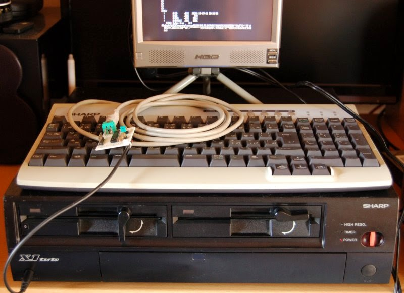
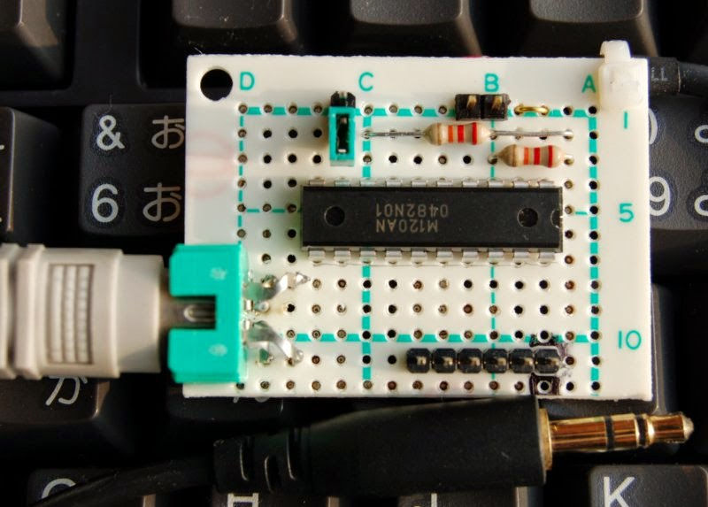
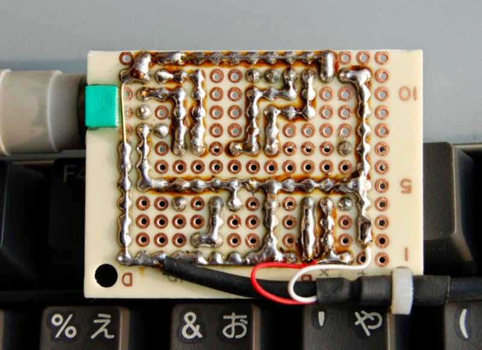
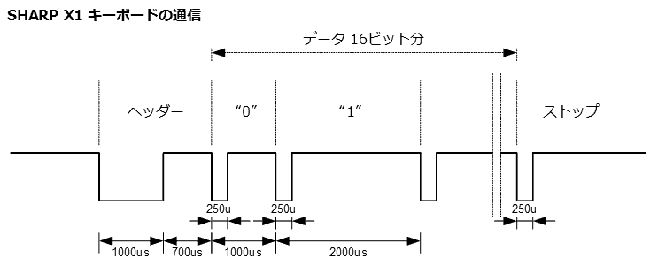
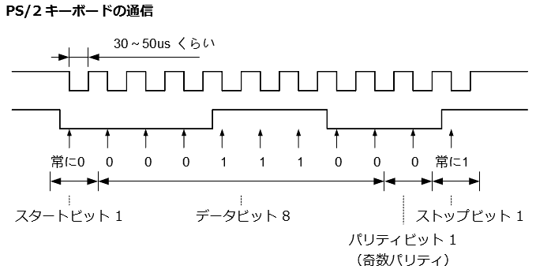
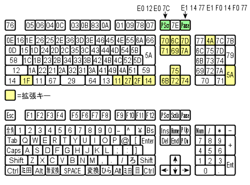
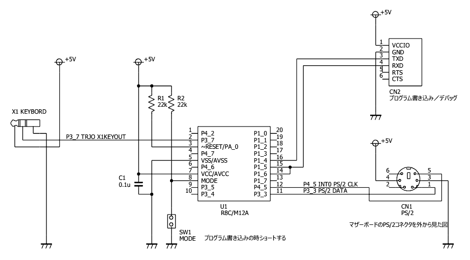

# SHARP X1 に PS/2 キーボードを繋いで使う


ジャンク品の SHARP X1 turboIII を購入したのですが、X1 用のキーボードを持っていないので Windowsパソコン用の PS/2 キーボードを接続するアダプターを作りました。

マイコンには、秋月電子で 1個 100円の ルネサス R8C/M12A を使っています。R8Cは専用の書き込み器が不要なので楽ちんでよいですね。
開発環境はルネサスの HEW（無償版）です。


## 目次
1. [ダウンロード](#ダウンロード)
2. [製作例](#製作例)
3. [動作説明](#動作説明)
    * [X1 キーボードの通信の様子](#x1-キーボードの通信の様子)
    * [PS/2 キーボードの通信の様子](#ps2-キーボードの通信の様子)
    * [PS/2からX1へのコード変換](#ps2からx1へのコード変換)
    * [回路図](#回路図)
4. [ファイル一覧](#ファイル一覧)
5. [ライセンス](#ライセンス)


## ダウンロード
* [回路図 (20140722)](R8C_X1KEYBORD_Schematic20140722.pdf)
* [R8C/M12A のファームウェア・ソースコード（HEWのプロジェクト一式）(20140728)](RELEASE/R8C_X1keybord20140728.zip)


## 製作例


PS/2 コネクタは、廃棄する Windows パソコンのマザーボードがら取り外して使用しました。X1 のキーボード端子に差し込む、3.5mmのステレオミニプラグは壊れたヘッドフォンから切断して使いました。

マイコンが秋月電子で 100円、そのほかにコンデンサ 1個、抵抗 2本、ピンヘッダ少々に基板の切れ端で、PS/2 コネクタとステレオミニプラグを除いた部品代は 300円くらいでしょうか。




## 動作説明

### X1 キーボードの通信の様子
X1のキーボードがどのような信号で通信しているのかを、[X1センター](http://www.x1center.org/)さんが資料を公開されていましたので、大変助かりました。X1 キーボードの実物を持っていないので、この資料がなかったら今回のアダプターを作ることはできませんでした。
X1 キーボードは 1線式のシリアル通信でキーコードとキーの状態を送信しています。通信は、キーボードから X1 本体への一方通行です。

#### SHARP X1 キーボードの通信信号


パルスとパルスの間隔が、長いか短いかで "0" と "1" を表しています。
ヘッダーの後、データ16ビットを **“上位ビット”** から順に送信して、最後にストップビットを送ります。ストップビットは、たぶんパルスがひとつ出ていればそれで良いのだと思います。次の送信まで少し間隔を開けるために、信号が HI の期間を適当に取っておくようにします。
X1センターさんの資料にある図では、ヘッダーの後にスタートビットが記載されていたのですが、スタートビット無しで正しく動いています。

#### 送出データ
|  bit  |                              |                                       |
| :---- | :--------------------------- | :------------------------------------ |
| bit15 | 0: テンキーやファンクションキー等 特殊キー（文字以外）からの入力 | 1: 通常のキー（文字や数字）からの入力 |
| bit14 | 0: キー入力有り               | 1: キー入力無し                         |
| bit13 | 0: リピート入力中             | 1: リピート入力じゃない                  |
| bit12 | 0: [GRAPH] が押されている	    | 1: 押されていない                       |
| bit11 | 0: [CAPS] がロック状態        | 1: [CAPS] ロック解除                    |
| bit10 | 0: [カナ] がロック状態        | 1: [カナ] ロック解除                     |
| bit 9 | 0: [SHIFT] が押されている     | 1: 押されていない                        |
| bit 8 | 0: [CTRL] が押されている      | 1: 押されていない                        |
| bit 7	| ASCII コード ( 0x00 ～ 0xFF / 0x00 = 入力無し )                         |
| bit 6 | ^                                                                     |
| bit 5 | ^                                                                     |
| bit 4 |                                                                       |
| bit 3 |                                                                       |
| bit 2 |                                                                       |
| bit 1 |                                                                       |
| bit 0 |                                                                       |

データは **上位ビット (bit15)** から順に 1ビットづつ送出します。キー固有のコードではなくて ASCII コードを送らなくてはならないのが面倒なところです。

実際の通信は
| KEY                   | DATA                           |
| :-------------------- | :----------------------------- |
| [A] 押した             | 0b10111111_'a' のアスキーコード |
| [A] 離した             | 0b11111111_00000000            |
| [SHIFT]+[a] 押した     | 0b10111101_'A' のアスキーコード |
| [SHIFT]+[a] 離した     | 0b11111111_00000000            |
| テンキーの[1] 押した    | 0b00111111_'1' のアスキーコード |
| テンキーの[1] 離した    | 0b11111111_00000000            |
| [SHIFT]+[GRAPH] 押した | 0b10101101_00000000            |
| [SHIFT]+[GRAPH] 離した | 0b11111111_00000000            |

こんな感じです。同じキーを押しても `[SHIFT]` を押した時とか `[CAPS]` をロックした時とか `[カナ]` をロックした時とかに応じて、送出する ASCII コードを変えなければなりません。うまく処理しましょう。

X1 （turboじゃない）のキーボードでは `[GRAPH]` `[CAPS]` `[カナ]` `[SHIFT]` `[CTRL]` のキーだけを押した時にはデータを送信せず、それ以外のキーが押された時にだけデータを送信します。

X1 turbo のキーボードでは `[GRAPH]` `[CAPS]` `[カナ]` `[SHIFT]` `[CTRL]` のキー単体の状態が変化した時もデータを送信します。この時に送出する ASCII コードは `0x00` で良いようです。
今回作ったアダプターでは、`[SHIFT] + [GRAPH]` なんかを入力できないと困るので、X1 turbo の仕様に合わせました。X1 turbo のキーボードを turbo じゃない X1 に接続しても問題ないので、X1 turbo に合わせておけばよいでしょう。

X1 turbo のキーボードは、切り替えスイッチを **モードB** に合わせると、上記の内容の他に複数キーの同時押しを伝えるデータを送出するのですが、今回作ったアダプタでは対応していません。


### PS/2 キーボードの通信の様子
以前 [X68000 のキーボードを PS/2 に変換するアダプター](https://kyoutan.jpn.org/uts/pc/pic/x68key2/)を作ったときに、PS/2 キーボードの通信内容を調べたので、今回は簡単に PS/2 の通信処理を書くことが出来ました。
PS/2 は、クロック同期式のシリアル通信で、クロックの **“立ち下がり”** でデータ有効になります。クロック信号で割り込みをかけて 1ビットづつ読み込むとか、マイコンのシリアル通信機能を使うとかして、簡単に処理できますね。

#### PS/2 キーボードの通信信号


データの並びは、スタートビット 1、データビット 8、パリティビット 1、ストップビット 1 になります。
データは **“下位ビット”** から順に送られます。パリティビットは **データビット** と **パリティビット** を合わせて **"1"** の数が **“奇数”** になるようにセットします。

Windowsパソコン等に PS/2 キーボードとして認識してもらうには、決まり事がいろいろあってちょっと面倒くさいのですが、今回のように PS/2 キーボードのデータを受信するだけなら、キーを押すたびに送られてくるキーコードを受信するだけで良くて簡単です。

PS/2キーボードは、ボタン一つ一つにキーコードが割り振られていて、キーが押された時にキーコードがそのまま送出され、キーが離されたときには、リリースコード “`F0`” に続いてキーコードが送出されます。押しつづけているとリピート動作に入って、押した時のキーコードが繰り返し送出されます。

`[A]` キーの場合を見てみると、押された時には “`1C`” が送出され、離された時には “`F0 1C`” が送出されます。

通常のキーは以上の通りなのですが、この他に拡張キーと、さらに特別なキーがあります。
拡張キーの場合、拡張キーであることを示す “`E0`” に続けてキーコードを送出します。具体的に `[DEL]` キーの例を見てみると、キーが押された時には “`E0 71`” を送出し、離された時には “`E0 F0 71`” を送出します。

`[Print Screen]` キーと `[Pause]` キーは拡張キーとも異なり、とても長いコードが使われています。

`[Print Screen]` キーは、押された時に “`E0 12 E0 7C`” 、リピート時には “`E0 7C`” 、離された時には “`E0 F0 7C E0 F0 12`” を送出します。ちょうど拡張キーを二つ組み合わせたような動作になっています。

`[Pause]` キーは、押された時だけ “`E1 14 77 E1 F0 14 F0 77`” を送出し、離された時には何も送出しません。リピートもしません。押された時にリリースコードもいっしょに送出してしまっているようです。

#### PS/2 キーボードのキーコード


#### PS/2 キーボードが送信するデータの例
| KEY                      | CODE                      |
| :----------------------- | :------------------------ |
| 通常キー                                              |
| `[A]` 押した              | `1C`                      |
| `[A]` リピート            | `1C`                      |
| `[A]` 離した              | `F0 1C`                   |
| 拡張キー                                              |
| `[DEL]` 押した            | `E0 71`                   |
| `[DEL]` リピート          | `E0 71`                   |
| `[DEL]` 離した            | `E0 F0 71`                |
| `[Print Screen]` 押した   | `E0 12 E0 7C`             |
| `[Print Screen]` リピート | `E0 7C`                   |
| `[Print Screen]` 離した   | `E0 F0 7C E0 F0 12`       |
| `[Pause]` 押した          | `E1 14 77 E1 F0 14 F0 77` |
| `[Pause]` リピート        | リピートしない             |
| `[Pause]` 離した          | 何もしない                 |


### PS/2からX1へのコード変換
PS/2 キーボードからデータを受信するたびに、キーコード変換テーブルを参照して ASCII コードを X1 に送出するようにしました。
グラフィック文字のコードや、ファンクションキーなんかのコードが、キーボードの実物が無くてわからないので、X1 エミュレーター Xmillennium v0.26 T-tune STEP 1.43 のソースコードに含まれている、キーコードテーブルを使用させていただきました。


### 回路図
#### PS/2 キーボードを SHARP X1 に繋ぐ回路図


マイコンにキーボードのコネクターがつながっているだけの簡単な回路です。

電源は X1 のキーボード端子の +5V から取っていますが、X1 のキーボード端子の +5V は短絡保護の為に電流を制限していて、PS/2 キーボードを動かすにはやや電流が少なく、PS/2 キーボードの起動に失敗する場合があるので、電源を X1 のキーボード端子から取らず、ACアダプタ等を使用したほうが良いように思います。

手持ちの PS/2 キーボードでは、キーボードコネクタを抜き差しした時に、時々キー入力ができなくなる程度で、再度抜き差しすれば動くようになるので、この回路図の通り X1 のキーボード端子から電源を取っています。

X1本体の電流制限抵抗を短絡してしまうのもいいかもしれません。


## ファイル一覧
```
README.MD                            この文書
R8C_X1KEYBORD_Schematic20140722.pdf  回路図
RELEASE/R8C_X1keybord20140728.zip    HEWのプロジェクト一式

SRC/                                 HEWのプロジェクト
SRC/X1keybord/iodefine.h             I/Oピン定義
SRC/X1keybord/keyconv.c              キーコード変換処理
SRC/X1keybord/keytable.h             キーコード変換テーブル
SRC/X1keybord/main.c                 main
SRC/X1keybord/ps2.c                  PS/2キーボード受信処理
SRC/X1keybord/timer.c                インターバルタイマー
SRC/X1keybord/uart.c                 UART送受信処理
SRC/X1keybord/x1key.c                X1キーボード送信処理
```


## ライセンス
この文章とコードは、CC0 Public Domain License で提供します。
https://creativecommons.org/publicdomain/zero/1.0/

2025年5月2日 佐藤恭一 kyoutan.jpn.org
